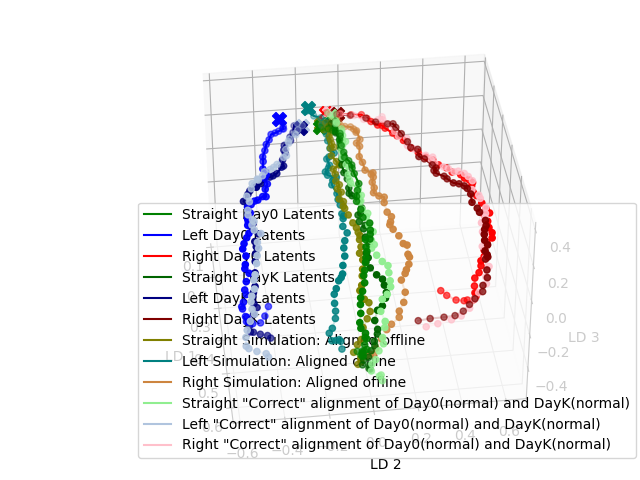

# Project Name

## Description

Description of the project—what it does, its main features, and why it’s useful.

---

## Table of Contents
1. Latent Extraction (PSID, DPAD, PCA and kPCA)
2. 3D Visualization (PSID, DPAD and PCA)
3. CCA offline Alignment
4. Online simulation: Training Data
5. Online simulation: Decoding Data
---

### 1. Latent Extraction (PSID, DPAD, PCA and kPCA)
The script L_PCA,PSID,DPAD_DR.py plots the three leading latents, using latent extraction from methods PSID (latents obtained using TrainingScript), DPAD (the script to obtain the latents is explained bellow) and PCA (latents are calculated directly in L_PCA,PSID,DPAD_DR.py). It also has the results obtained using kPCA extraction (latents are also calculated directly). It also saves the PCA and kPCA latents to pickle files.

Using this script, I obtain the following images:

#### 1.1 Extraction of DPAD Latents:
To obtain the DPAD latents, it is necessary to use the DPAD folder, instead of the 0N_Decoding_algorithm folder. The DPAD code is adapted from the DPAD paper and repository: 
https://www.nature.com/articles/s41593-024-01731-2
https://github.com/ShanechiLab/DPAD

The directory for the folder used to calculate the DPAD latents is DPAD\source\DPAD\example\leonor_ourData.py.

Running the code will create DPAD_latents.pkl, a file that stores the DPAD latents. In the end, it also indicates the CC of decoding and self-prediction.

### 2. 3D Visualization (PSID, DPAD and PCA)
The script L_PCA,PSID,DPAD_3D_visualization.py plots the 6 latents dimensions in a 3D representation.
In the beginning, you choose the latent to the visualized (can be PSID, DPAD or PCA).

It shows the 3D representation using the following methods (that further reduce the data from 6D to 3D): none (which shows only the 3 leading neural modes), PCA, kPCA, t-SNE, Isomap, LDA and LLE (there 4 LLE methods used)

using latent extraction from methods PSID (latents obtained using TrainingScript), DPAD (the script to obtain the latents is explained bellow) and PCA (latents are calculated directly in L_PCA,PSID,DPAD_DR.py). It also has the results obtained using kPCA extraction (latents are also calculated directly).

Using this script, I obtain the following images:

### 3.1 CCA offline Alignment
To analyse the role of CCA in latents, I first used the following 2 scripts: 
L_CCAalignment_diff_monkeys.py 
L_CCAalignment_diff_days.py
They are very similar, the main differences are the descriptions of the images (to say monkey/day respectively).

Using these, I obtain the following images:

**Note 1:** In these 2 scripts, I am calculating the CCA coefficients, using the full direction data. For even better results, change to apply the average direction data.

**Note 2:** In these 2 scripts, I am using dictionaries to be able to separate the Left/Straight/Right data. This is not necessary and less flexible. In codes ahead, I use lists/arrays and just separate the data by direction afterward.

### 3.2 CCA offline Alignment
For further analysis of the role of CCA in latents, I used the following scripts: 

- offline_CCA.py: performs CCA alignment using the full direction data. 

- offline_kabsch.py: performs kabsch alignment using the full direction data. Kabsch alignment also seems to work well, giving slightly different results. 

- offline_CCA_with_avg.py: performs CCA alignment using the average direction data (which gives better results).

For each, I obtain the following images:

### 4. Online simulation: Training Data
First off, I tested the online simulation script, with training data and model both from Day-0, without alignment, to see what the result would be. I used the Online_simulation_no_alignment.py script, to obtain the following image:

Secondly, I used the Online_simulation_latent_alignment_all_direction.py script, to apply CCA alignment to training data. In this case, the CCA coefficients were calculated using the full direction data.
I obtained the following image:

With this script, I also obtained the image for Day-0 model and Day-K data, without alignment:

Thirdly, I used the Online_simulation_latent_alignment_direction_avg.py script, to apply CCA alignment to training data. In this case, the CCA coefficients were calculated using the average of the directions (nicer results than full data).
I obtained the following image:

Using the Online_simulation_latent_alignment_direction_avg_Kalman.py script, I can study the effect of using the Kalman latents (computed beforehand):

**To compute the Kalman latents, it is necessary to uncomment some lines of code in the filters.py script!**

To help me understand if the CCA alignment was happening correctly, I used the analysis_offline_latents_online_simulation_with_data_split.py script - it allowed for observing the shape of the latents and seeing if it was the expected result.  
An example is:

**Note 1:** In order for the code to work, I made changes to navbcidecode\bcidecode\kalman\filters.py and slight changes to navbcidecode\bcidecode\online\models.py

**Note 2:** I used the Online_simulation_data_alignment.py script to try performing data alignment (directly on the data), but this didn't work, as expected.

### 5. Online simulation: Decoding Data
It is not necessary to get the decoding latents for the online simulation of the decoding data. For that, I only need the latents of the training of both days.

With Online_decoding_no_alignment.py, I get the decoding for no alignment (should be identical to the monkey trajectory):

With Online_decoding_latent_alignment_decoding_file_CCAavgalignment.py, I get an idea of how the decoding would look like if there was CCA alignment (although there is no feedback):

**RIGHT image:** (the correct result! I am aligning the decoding latents)

**WRONG image:** (was aligning the training latents instead of the decoding latents)
